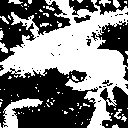

# Q. 1 - 10

## Q.1. 通道交换

读取图像，然后将 RGB 通道替换成 BGR 通道。

下面的代码用于提取图像的红色通道。注意，`cv2.imread()` 的系数是按 BGR 顺序排列的！其中的变量 `red` 表示的是仅有原图像红通道的 `imori.jpg`。

```python
import cv2
img = cv2.imread("imori.jpg")
red = img[:, :, 2].copy()
```

| 输入 (imori.jpg) | 输出 (answers/answer_1.jpg) |
| :--------------: | :-------------------------: |
|    |    |

答案 
Python >> [answers/answer_1.py](https://github.com/yoyoyo-yo/Gasyori100knock/blob/master/Question_01_10/answers/answer_1.py)
C++ >> [answers_cpp/answer_1.py](https://github.com/yoyoyo-yo/Gasyori100knock/blob/master/Question_01_10/answers_cpp/answer_1.py)

## Q.2. 灰度化（Grayscale）

将图像灰度化吧！灰度是一种图像亮度的表示方法，通过下式计算：

Y = 0.2126 R + 0.7152 G + 0.0722 B

| 输入 (imori.jpg) | 输出 (answers/answer_2.jpg) |
| :--------------: | :-------------------------: |
|    |    |

答案
Python >> [answers/answer_2.py](https://github.com/yoyoyo-yo/Gasyori100knock/blob/master/Question_01_10/answers/answer_2.py)
C++ >> [answers_cpp/answer_2.py](https://github.com/yoyoyo-yo/Gasyori100knock/blob/master/Question_01_10/answers_cpp/answer_2.py)
## Q.3. 二值化（Thresholding）

把图像进行二值化吧！二值化是将图像使用黑和白两种值表示的方法。这里我们将灰度的阈值设置为 128 来进行二值化，即：

```bash
y = { 0 (if y < 128)
     255 (else) 
```

| 输入 (imori.jpg) | 输出 (answers/answer_3.jpg) |
| :--------------: | :-------------------------: |
|    |    |

答案 
Python >> [answers/answer_3.py](https://github.com/yoyoyo-yo/Gasyori100knock/blob/master/Question_01_10/answers/answer_3.py)
C++ >> [answers_cpp/answer_3.py](https://github.com/yoyoyo-yo/Gasyori100knock/blob/master/Question_01_10/answers_cpp/answer_3.py)
## Q.4. 大津二值化算法（Otsu's Method）

使用大津算法来二值化图像吧！大津算法，也被称作最大类间方差法，是一种可以自动确定二值化中阈值的算法，从类内[方差](https://ja.wikipedia.org/wiki/%E5%88%86%E6%95%A3_(%E7%A2%BA%E7%8E%87%E8%AB%96))和类间方差的比值计算得来：


- 小于阈值 t 的类记作 0，大于阈值 t 的类记作 1；
- w0 和 w1 是被阈值 t 分开的两个类中的像素数占总像素数的比率（满足 w0+w1=1）；
- S0^2, S1^2 是这两个类中像素值的方差；
- M0, M1 是这两个类的像素值的平均值；

也就是说：

```bash
类内方差：Sw^2 = w0 * S0^2 + w1 * S1^2
类间方差：Sb^2 = w0 * (M0 - Mt)^2 + w1 * (M1 - Mt)^2 = w0 * w1 * (M0 - M1) ^2
图像所有像素的方差：St^2 = Sw^2 + Sb^2 = (const)
根据以上的式子，我们用以下的式子计算分离度：  
分离度 X = Sb^2 / Sw^2 = Sb^2 / (St^2 - Sb^2)
```

也就是说： 

```bash
argmax_{t} X = argmax_{t} Sb^2
```
换言之，如果使 Sb^2 =  w0 * w1 * (M0 - M1) ^2 最大，就可以得到最好的二值化阈值 t。

| 输入 (imori.jpg) | 输出 (th = 127) (answers/answer_4.jpg) |
| :--------------: | :------------------------------------: |
|    |               |

答案
Python >> [answers/answer_4.py](https://github.com/yoyoyo-yo/Gasyori100knock/blob/master/Question_01_10/answers/answer_4.py)
C++ >> [answers_cpp/answer_4.py](https://github.com/yoyoyo-yo/Gasyori100knock/blob/master/Question_01_10/answers_cpp/answer_4.py)

## Q.5. HSV 变换

将使用 HSV 表示色彩的图像的色相反转吧！

HSV 即使用**色相（Hue）、饱和度（Saturation）、明度（Value）**来表示色彩的一种方式。

- 色相：将颜色使用0到360度表示，就是平常所说的颜色名称，如红色、蓝色。色相与数值按下表对应：

  | 红  | 黄  | 绿  | 青色 | 蓝色 | 品红 | 红  |
  | --- | --- | --- | ---- | ---- | ---- | --- |
  | 0   | 60  | 120 | 180  | 240  | 300  | 360 |

- 饱和度：是指色彩的纯度，饱和度越低则颜色越黯淡( 0<= S < 1)；
- 明度：即颜色的明暗程度。数值越高越接近白色，数值越低越接近黑色 ( 0 <= V < 1)；

从 RGB 色彩表示转换到 HSV 色彩表示通过以下方式计算：

R,G,B的值在[0, 1]之间：

```bash
Max = max(R,G,B)
Min = min(R,G,B)

H =  { 0                            (if Min=Max)
       60 x (G-R) / (Max-Min) + 60  (if Min=B)
       60 x (B-G) / (Max-Min) + 180 (if Min=R)
       60 x (R-B) / (Max-Min) + 300 (if Min=G)
       
V = Max

S = Max - Min
```

从 HSV 色彩表示转换到 RGB 色彩表示通过以下方式计算：

```bash
C = S

H' = H / 60

X = C (1 - |H' mod 2 - 1|)

(R,G,B) = (V - C) (1,1,1) + { (0, 0, 0)  (if H is undefined)
                              (C, X, 0)  (if 0 <= H' < 1)
                              (X, C, 0)  (if 1 <= H' < 2)
                              (0, C, X)  (if 2 <= H' < 3)
                              (0, X, C)  (if 3 <= H' < 4)
                              (X, 0, C)  (if 4 <= H' < 5)
                              (C, 0, X)  (if 5 <= H' < 6)
```
请将色相反转（色相值加180），然后再用 RGB 色彩空间表示图片。

| 输入 (imori.jpg) | 输出 (answers/answer_5.jpg) |
| :--------------: | :-------------------------: |
|    |    |

答案 
Python >> [answers/answer_5.py](https://github.com/yoyoyo-yo/Gasyori100knock/blob/master/Question_01_10/answers/answer_5.py)
C++ >> [answers_cpp/answer_5.py](https://github.com/yoyoyo-yo/Gasyori100knock/blob/master/Question_01_10/answers_cpp/answer_5.py)

## Q.6. 减色处理

> 这里没有找到"減色処理"准确的中文翻译，所以直译了。
>
> ——gzr

这里我们将图像的值由256^3压缩至4^3，即将 RGB 的值只取 {32, 96, 160, 224}。这被称作色彩量化。色彩的值按照下面的方式定义：

```bash
val = {  32  (  0 <= val <  64)
         96  ( 64 <= val < 128)
        160  (128 <= val < 192)
        224  (192 <= val < 256)
```
| 输入 (imori.jpg) | 输出 (answers/answer_6.jpg) |
| :--------------: | :-------------------------: |
|    |    |

答案 
Python >> [answers/answer_6.py](https://github.com/yoyoyo-yo/Gasyori100knock/blob/master/Question_01_10/answers/answer_6.py)
C++ >> [answers_cpp/answer_6.py](https://github.com/yoyoyo-yo/Gasyori100knock/blob/master/Question_01_10/answers_cpp/answer_6.py)

## Q.7. 平均池化（Average Pooling）

将图片按照固定大小网格分割，网格内的像素值取网格内所有像素的平均值。我们将这种把图片使用均等大小网格分割，并求网格内代表值的操作称为池化（Pooling）。池化操作是卷积神经网络（Convolutional Neural Network）中重要的图像处理方式。平均池化按照下式定义：

```bash
v = 1/|R| * Sum_{i in R} v_i
```

请把大小为 128x128 的`imori.jpg`使用 8x8 的网格做平均池化。

| 输入 (imori.jpg) | 输出 (answers/answer_7.jpg) |
| :--------------: | :-------------------------: |
|    |    |

答案 
Python >> [answers/answer_7.py](https://github.com/yoyoyo-yo/Gasyori100knock/blob/master/Question_01_10/answers/answer_7.py)
C++ >> [answers_cpp/answer_7.py](https://github.com/yoyoyo-yo/Gasyori100knock/blob/master/Question_01_10/answers_cpp/answer_7.py)

## Q.8. 最大池化（Max Pooling）

网格内的值不取平均值，而是取网格内的最大值进行池化操作。

| 输入 (imori.jpg) | 输出 (answers/answer_8.jpg) |
| :--------------: | :-------------------------: |
|    |    |

答案
Python >> [answers/answer_8.py](https://github.com/yoyoyo-yo/Gasyori100knock/blob/master/Question_01_10/answers/answer_8.py)
C++ >> [answers_cpp/answer_8.py](https://github.com/yoyoyo-yo/Gasyori100knock/blob/master/Question_01_10/answers_cpp/answer_8.py)

## Q.9. 高斯滤波（Gaussian Filter）

使用高斯滤波器（3x3 大小，标准差 s=1.3​）来对`imori_noise.jpg`进行降噪处理吧！

高斯滤波器是一种可以使图像平滑的滤波器，用于去除噪声。可用于去除噪声的滤波器还有中值滤波器（参见问题10），平滑滤波器（参见问题11）、LoG 滤波器（参见问题19）。

高斯滤波器将中心像素周围的像素按照高斯分布加权平均进行平滑化。这样的（二维）权值通常被称为卷积核或者滤波器。

但是，由于图像的长宽可能不是滤波器大小的整数倍，因此我们需要在图像的边缘补0。这种方法称作 Zero Padding。并且权值（卷积核）要进行[归一化操作](https://blog.csdn.net/lz0499/article/details/54015150)(sum g = 1)。

```bash
权值 g(x,y,s) = 1/ (s*sqrt(2 * pi)) * exp( - (x^2 + y^2) / (2*s^2))
标准差 s = 1.3 的 8 近邻 高斯滤波器如下：
            1 2 1
K =  1/16 [ 2 4 2 ]
            1 2 1
```

| 输入 (imori_noise.jpg) | 输出 (answers/answer_9.jpg) |
| :--------------------: | :-------------------------: |
|    |    |

答案 
Python >> [answers/answer_9.py](https://github.com/yoyoyo-yo/Gasyori100knock/blob/master/Question_01_10/answers/answer_9.py)
C++ >> [answers_cpp/answer_9.py](https://github.com/yoyoyo-yo/Gasyori100knock/blob/master/Question_01_10/answers_cpp/answer_9.py)

## Q.10 中值滤波（Median filter）

使用中值滤波器（3x 3大小）来对`imori_noise.jpg`进行降噪处理吧！

中值滤波器是一种可以使图像平滑的滤波器。这种滤波器用滤波器范围内（在这里是3x3）像素点的中值进行滤波，在这里也采用 Zero Padding。

| 输入 (imori_noise.jpg) | 输出 (answers/answer_10.jpg) |
| :--------------------: | :--------------------------: |
|    |    |

答案 
Python >> [answers/answer_10.py](https://github.com/yoyoyo-yo/Gasyori100knock/blob/master/Question_01_10/answers/answer_10.py)
C++ >> [answers_cpp/answer_10.py](https://github.com/yoyoyo-yo/Gasyori100knock/blob/master/Question_01_10/answers_cpp/answer_10.py)
