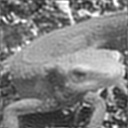
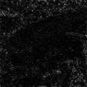
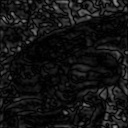

# Q. 31 - 40

## Q.31. 仿射变换（Afine Transformations）——倾斜

1. 使用仿射变换，输出（1）那样的x轴倾斜30度的图像（dx=30），这种变换被称为`X-sharing`。
2. 使用仿射变换，输出（2）那样的y轴倾斜30度的图像（dy=30），这种变换被称为`Y-sharing`。
3. 使用仿射变换，输出（3）那样的x轴、y轴都倾斜30度的图像(dx = 30, dy = 30)。

原图像的大小为hxw，使用下面各式进行仿射变换。

```bash
(1) X-sharing                  (2) Y-sharing
   a = dx / h                     a = dy / w

  x'       1 a tx    x           x'       1 0 tx    x
[ y' ] = [ 0 1 ty ][ y ]       [ y' ] = [ a 1 ty ][ y ]
  1        0 0  1    1           1        0 0  1    1
```

| 输入 (imori.jpg) | 输出 (1) (answers/answer_31_1.jpg) | 输出 (2) (answers/answer_31_2.jpg) | 输出 (3) (answers/answer_31_3.jpg) |
| :--------------: | :--------------------------------: | :--------------------------------: | :--------------------------------: |
|    |        |        |        |

答案 >> [answers/answer_31.py](https://github.com/yoyoyo-yo/Gasyori100knock/blob/master/Question_31_40/answers/answer_31.py)

## Q.32. 傅立叶变换（Fourier Transform）

使用离散二维傅立叶变换（Discrete Fourier Transformation），将灰度化的`imori.jpg`表示为频谱图。然后用二维离散傅立叶逆变换将图像复原。

二维离散傅立叶变换是傅立叶变换在图像处理上的应用方法。通常傅立叶变换用于分离模拟信号或音频等连续一维信号的频率。但是，数字图像使用[0,255]范围内的离散值表示，并且图像使用HxW的二维矩阵表示，所以在这里使用二维离散傅立叶变换。

二维离散傅立叶变换使用下式计算，其中I表示输入图像：

```bash
K = 0:W, l = 0:H, 输入画像をI として
G(k,l) = Sum_{y=0:H-1, x=0:W-1} I(x,y) exp( -2pi * j * (kx/W + ly/H)) / sqrt(H * W)
```

在这里让图像灰度化后，再进行离散二维傅立叶变换。

频谱图为了能表示复数G，所以图上所画长度为G的绝对值。这回的图像表示时，请将频谱图缩放至[0,255]范围。

二维离散傅立叶逆变换从频率分量G按照下式复原图像：

```bash
x = 0:W, y = 0:H  として
I(x,y) = Sum_{l=0:H-1, k=0:W-1} G(k,l) exp( 2pi * j * (kx/W + ly/H)) / sqrt(H * W)
```

| 输入 (imori.jpg) | 灰度化 (imori_gray.jpg) | 输出 (answers/answer_32.jpg) | 频谱图 (answers/answer_32_ps.py) |
| :--------------: | :---------------------: | :--------------------------: | :------------------------------: |
|    |      |    |     |

答案 >> [answers/answer_32.py](https://github.com/yoyoyo-yo/Gasyori100knock/blob/master/Question_31_40/answers/answer_32.py)

## Q.33. 傅立叶变换——低通滤波

将`imori.jpg`灰度化之后进行傅立叶变换并进行低通滤波，之后再用傅立叶逆变换复原吧！

通过离散傅立叶变换得到的频率在左上、右上、左下、右下等地方频率较低，在中心位置频率较高。

在图像中，高频成分指的是颜色改变的地方（噪声或者轮廓等），低频成分指的是颜色不怎么改变的部分（比如落日的渐变）。在这里，使用去除高频成分，保留低频成分的低通滤波器吧！

在这里，假设从低频的中心到高频的距离为r，我们保留0.5r​的低频分量。

| 输入 (imori.jpg) | 灰度化 (imori_gray.jpg) | 输出 (answers/answer_33.jpg) |
| :--------------: | :---------------------: | :--------------------------: |
|    |      |    |

答案 >> [answers/answer_33.py](https://github.com/yoyoyo-yo/Gasyori100knock/blob/master/Question_31_40/answers/answer_33.py)

## Q.34. 傅立叶变换——高通滤波

将`imori.jpg`灰度化之后进行傅立叶变换并进行高通滤波，之后再用傅立叶逆变换复原吧！

在这里，我们使用可以去除低频部分，只保留高频部分的高通滤波器。假设从低频的中心到高频的距离为r，我们保留0.2r​的低频分量。

| 输入 (imori.jpg) | 灰度化 (imori_gray.jpg) | 输出 (answers/answer_34.jpg) |
| :--------------: | :---------------------: | :--------------------------: |
|    |      |    |

答案 >> [answers/answer_34.py](https://github.com/yoyoyo-yo/Gasyori100knock/blob/master/Question_31_40/answers/answer_34.py)

## Q.35. 傅立叶变换——带通滤波

将`imori.jpg`灰度化之后进行傅立叶变换并进行带通滤波，之后再用傅立叶逆变换复原吧！

在这里，我们使用可以保留介于低频成分和高频成分之间的分量的带通滤波器。在这里，我们使用可以去除低频部分，只保留高频部分的高通滤波器。假设从低频的中心到高频的距离为r，我们保留0.1r至0.5r的分量。  

| 输入 (imori.jpg) | 灰度化 (imori_gray.jpg) | 输出 (answers/answer_35.jpg) |
| :--------------: | :---------------------: | :--------------------------: |
|    |      |    |

答案 >> [answers/answer_35.py](https://github.com/yoyoyo-yo/Gasyori100knock/blob/master/Question_31_40/answers/answer_35.py)

## Q.36. JPEG 压缩——第一步：离散余弦变换（Discrete Cosine Transformation）

`imori.jpg`灰度化之后，先进行离散余弦变换，再进行离散余弦逆变换吧！

离散余弦变换（Discrete Cosine Transformation）是一种使用下面式子计算的频率变换：

```bash
T = 8
F(u,v) = 1 / T * C(u)C(v) * Sum_{y=0:T-1} Sum_{x=0:T-1} f(x,y) cos((2x+1)u*pi/2T) cos((2y+1)v*pi/2T)
```

离散余弦逆变换（Inverse Discrete Cosine Transformation）是离散余弦变换的逆变换，使用下式定义：

```bash
f(x,y) = 1 / T * C(x)C(y) * Sum_{u=0:T-1} Sum_{v=0:T-1} F(u,v) cos((2x+1)u*pi/2T) cos((2y+1)v*pi/2T)
```

在这里我们先将图像分割成8x 8的小块，在各个小块中使用离散余弦变换编码，使用离散余弦逆变换解码，这就是 JPEG 的互逆过程。现在我们也同样地，把图像分割成8x 8的小块，然后进行离散余弦变换和离散余弦逆变换。

> 这一整段我整体都在瞎**译，原文如下：
>
> ここでは画像を8x8ずつの領域に分割して、各領域で以上のDCT, IDCTを繰り返すことで、JPEG符号に応用される。 今回も同様に8x8の領域に分割して、DCT, IDCTを行え。
>
> ——gzr

| 输入 (imori.jpg) | 灰度化 (imori_gray.jpg) | 输出 (1) (answers/answer_36.jpg) |
| :--------------: | :---------------------: | :------------------------------: |
|    |      |        |

答案 >> [answers/answer_36.py](https://github.com/yoyoyo-yo/Gasyori100knock/blob/master/Question_31_40/answers/answer_36.py)

## Q.37. PSNR

离散余弦逆变换中如果不使用8作为系数，而是使用4作为系数的话，图像的画质会变差。来求输入图像和经过离散余弦逆变换之后的图像的峰值信噪比吧！再求出离散余弦逆变换的比特率吧！

峰值信噪比（Peak Signal to Noise Ratio）缩写为PSNR，用来表示信号最大可能功率和影响它的表示精度的破坏性噪声功率的比值，可以显示图像画质损失的程度。

峰值信噪比越大，表示画质损失越小。峰值信噪比通过下式定义。MAX表示图像点颜色的最大数值。如果取值范围是[0,255]的话，那么MAX的值就为255。MSE表示均方误差（Mean Squared Error），用来表示两个图像各个像素点之间差值平方和的平均数。


```bash
PSNR = 10 * log10(MAX^2 / MSE)
MSE = Sum_{y=0:H-1} Sum_{x=0:W-1} (I1(x,y) - I2(x,y))^2 / (HW)
```

如果我们进行8x8的离散余弦变换，离散余弦逆变换的系数为KxK的话，比特率按下式定义：ビットレートとは8x8でDCTを行い、IDCTでKxKの係数までを用いた時に次式で定義される。

```bash
bitrate = 8 * K^2 / 8^2
```

| 输入 (imori.jpg) |       灰度化        | 输出 (answers/answer_37.jpg) (PSNR = 27.62, Bitrate=2.0) |
| :--------------: | :-----------------: | :------------------------------------------------------: |
|    |  |                                |

答案 >> [answers/answer_37.py](https://github.com/yoyoyo-yo/Gasyori100knock/blob/master/Question_31_40/answers/answer_37.py)

## Q.38. JPEG 压缩——第二步：离散余弦变换+量化

量化离散余弦变换系数并使用 离散余弦逆变换恢复。再比较变换前后图片的大小。

量化离散余弦变换系数是用于编码 JPEG 图像的技术。

量化即在对值在预定义的区间内舍入，其中`floor`、`ceil`、`round`等是类似的计算。

在 JPEG 图像中，根据下面所示的量化矩阵量化离散余弦变换系数。该量化矩阵取自 JPEG 软件开发联合会组织颁布的标准量化表。在量化中，将8x 8的系数除以（量化矩阵） Q 并四舍五入。之后然后再乘以 Q 。对于离散余弦逆变换，应使用所有系数。

```bash
Q = np.array(((16, 11, 10, 16, 24, 40, 51, 61),
              (12, 12, 14, 19, 26, 58, 60, 55),
              (14, 13, 16, 24, 40, 57, 69, 56),
              (14, 17, 22, 29, 51, 87, 80, 62),
              (18, 22, 37, 56, 68, 109, 103, 77),
              (24, 35, 55, 64, 81, 104, 113, 92),
              (49, 64, 78, 87, 103, 121, 120, 101),
              (72, 92, 95, 98, 112, 100, 103, 99)), dtype=np.float32)
```

由于量化降低了图像的大小，因此可以看出数据量已经减少。

| 输入 (imori.jpg) |     灰度化(9kb)     | 输出 (answers/answer_38.jpg) (7kb) |
| :--------------: | :-----------------: | :--------------------------------: |
|    |  |          |

答案 >> [answers/answer_38.py](https://github.com/yoyoyo-yo/Gasyori100knock/blob/master/Question_31_40/answers/answer_38.py)

## Q.39. JPEG 压缩——第三步：YCbCr 色彩空间

在 YCbCr 色彩空间内，将 Y 乘以0.7以使对比度变暗。

YCbCr 色彩空间是用于将图像由表示亮度的 Y、表示蓝色色度Cb以及表示红色色度Cr表示的方法。

这用于 JPEG 转换。

使用下式从 RGB 转换到 YCbCr：

```bash
Y = 0.299 * R + 0.5870 * G + 0.114 * B
Cb = -0.1687 * R - 0.3313 * G + 0.5 * B + 128
Cr = 0.5 * R - 0.4187 * G - 0.0813 * B + 128
```

使用下式从 YCbCr 转到 RGB：

```bash
R = Y + (Cr - 128) * 1.402
G = Y - (Cb - 128) * 0.3441 - (Cr - 128) * 0.7139
B = Y + (Cb - 128) * 1.7718
```

| 输入 (imori.jpg) | 输出 (answers/answer_39.jpg) |
| :--------------: | :--------------------------: |
|    |    |

答案 >> [answers/answer_39.py](https://github.com/yoyoyo-yo/Gasyori100knock/blob/master/Question_31_40/answers/answer_39.py)

## Q.40. JPEG 压缩——第四步：YCbCr+离散余弦变换+量化

将图像转为 YCbCr 色彩空间之后，进行 离散余弦变换再对 Y 用 Q1 量化矩阵量化，Cb 和 Cr 用 Q2 量化矩阵量化。最后通过离散余弦逆变换对图像复原。还需比较图像的容量。

这是实际生活中使用的减少 JPEG 数据量的方法，Q1 和 Q2 根据 JPEG 规范由以下等式定义：

```bash
Q1 = np.array(((16, 11, 10, 16, 24, 40, 51, 61),
               (12, 12, 14, 19, 26, 58, 60, 55),
               (14, 13, 16, 24, 40, 57, 69, 56),
               (14, 17, 22, 29, 51, 87, 80, 62),
               (18, 22, 37, 56, 68, 109, 103, 77),
               (24, 35, 55, 64, 81, 104, 113, 92),
               (49, 64, 78, 87, 103, 121, 120, 101),
               (72, 92, 95, 98, 112, 100, 103, 99)), dtype=np.float32)

Q2 = np.array(((17, 18, 24, 47, 99, 99, 99, 99),
               (18, 21, 26, 66, 99, 99, 99, 99),
               (24, 26, 56, 99, 99, 99, 99, 99),
               (47, 66, 99, 99, 99, 99, 99, 99),
               (99, 99, 99, 99, 99, 99, 99, 99),
               (99, 99, 99, 99, 99, 99, 99, 99),
               (99, 99, 99, 99, 99, 99, 99, 99),
               (99, 99, 99, 99, 99, 99, 99, 99)), dtype=np.float32)
```

| 输入 (imori.jpg) (13kb) | 输出 (answers/answer_40.jpg) (8kb) |
| :---------------------: | :--------------------------------: |
|           |          |

答案 >> [answers/answer_40.py](https://github.com/yoyoyo-yo/Gasyori100knock/blob/master/Question_31_40/answers/answer_40.py)

