# Q. 41 - 50

## Q.41. Canny 边缘检测：第一步——边缘强度

问题41至问题43是边缘检测方法中的一种——Canny 边缘检测法的理论介绍。

1. 使用高斯滤波；
2. 在x方向和y方向上使用 Sobel 滤波器，在此之上求出边缘的强度和边缘的梯度；
3. 对梯度幅值进行非极大值抑制（Non-maximum suppression）来使边缘变得更细；
4. 使用滞后阈值来对阈值进行处理。

上面就是图像边缘检测的方法了。在这里我们先完成第一步和第二步。按照以下步骤进行处理：
1. 将图像进行灰度化处理；
2. 将图像进行高斯滤波（5x 5,s=1.4）；
3. 在x方向和y方向上使用 Sobel 滤波器，在此之上求出边缘梯度fx和fy。边缘梯度可以按照下式求得：

```bash
梯度幅值 edge = sqrt(fx^2 + fy^2)
梯度方向 tan = arctan(fy / fx)
```

4. 使用下面的公式将梯度方向量化：

```bash
angle = {   0  (if -0.4142 < tan <= 0.4142)
           45  (if  0.4142 < tan < 2.4142)
           90  (if  |tan| >= 2.4142)
          135  (if -2.4142 < tan <= -0.4142)
```

请使用`numpy.pad()`来设置滤波器的`padding`吧！

| 输入 (imori.jpg) | 输出(梯度幅值) (answers/answer_41_1.jpg) | 输出(梯度方向) (answers/answer_41_2.jpg) |
| :--------------: | :--------------------------------------: | :--------------------------------------: |
|    |       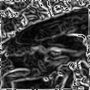       |       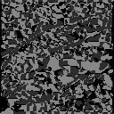       |

答案 >> [answers/answer_41.py](https://github.com/yoyoyo-yo/Gasyori100knock/blob/master/Question_41_50/answers/answer_41.py)

## Q.42. Canny 边缘检测：第二步——边缘细化

在这里我们完成 Canny 边缘检测的第三步。

我们从在第42问中求出的边缘梯度进行非极大值抑制，来对边缘进行细化。

非极大值抑制是对除去非极大值以外的值的操作的总称（这个术语在其它的任务中也经常出现）。

在这里，我们比较我们我们所关注的地方梯度的法线方向邻接的三个像素点的梯度幅值，如果该点的梯度值不比其它两个像素大，那么这个地方的值设置为0。

也就是说，我们在注意梯度幅值edge(x,y)的时候，可以根据下式由梯度方向angle(x,y)来变换edge(x,y)：

```bash
if angle(x,y)  = 0
 if edge(x,y), edge(x-1,y), edge(x+1,y)で edge(x,y)が最大じゃない
  then edge(x,y) = 0
if angle(x,y)  = 45
 if edge(x,y), edge(x-1,y+1), edge(x+1,y-1)で edge(x,y)が最大じゃない
  then edge(x,y) = 0
if angle(x,y)  = 90
 if edge(x,y), edge(x,y-1), edge(x,y+1)で edge(x,y)が最大じゃない
  then edge(x,y) = 0
if angle(x,y)  = 135
 if edge(x,y), edge(x-1,y-1), edge(x+1,y+1)で edge(x,y)が最大じゃない
  then edge(x,y) = 0
```

| 输入 (imori.jpg) | 输出 (answers/answer_42.jpg) |
| :--------------: | :--------------------------: |
|    |  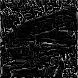  |

答案 >> [answers/answer_42.py](https://github.com/yoyoyo-yo/Gasyori100knock/blob/master/Question_41_50/answers/answer_42.py)

## Q.43. Canny 边缘检测：第三步——滞后阈值

在这里我们进行 Canny 边缘检测的最后一步。

在这里我们将通过设置高阈值和低阈值来将梯度幅值二值化。

1. 如果梯度幅值edge(x,y)大于高阈值的话，令edge(x,y)=255；
2. 如果梯度幅值edge(x,y)小于低阈值的话，令edge(x,y)=0；
3. 如果梯度幅值edge(x,y)介于高阈值和低阈值之间并且周围8邻域内有比高阈值高的像素点存在，令edge(x,y)=255；

在这里，我们使高阈值为100，低阈值为30。顺便说一句，我们只需要在查看结果时判断阈值。

上面的算法就是 Canny 边缘检测算法了。

| 输入 (imori.jpg) | 输出 (answers/answer_43.jpg) |
| :--------------: | :--------------------------: |
|    |  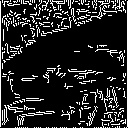  |

答案 >> [answers/answer_43.py](https://github.com/yoyoyo-yo/Gasyori100knock/blob/master/Question_41_50/answers/answer_43.py)

## Q.44. 霍夫变换（Hough Transform）／直线检测——第一步：霍夫变换

1. 第44问到第46问进行霍夫直线检测算法。

   霍夫变换，是将座标由直角座标系变换到极座标系，然后再根据数学表达式检测某些形状（如直线和圆）的方法。当直线上的点变换到极座标中的时候，会交于一定的r,t的点。这个点即为要检测的直线的参数。通过对这个参数进行逆变换，我们就可以求出直线方程。

   方法如下：

   1. 我们用边缘图像来对边缘像素进行霍夫变换。
   2. 在霍夫变换后获取值的直方图并选择最大点。
   3. 对极大点的r和t的值进行霍夫逆变换以获得检测到的直线的参数。

   在这里，进行一次霍夫变换之后，可以获得直方图。算法如下：

   1. 求出图像的对角线长 rmax；

   2. 在边缘点(x，y)处，t取遍[0,179]，根据下式执行霍夫变换：

      ```
      r = x * cos(t) + y * sin(t)
      ```

   3. 做一个180x rmax大小的表，将每次按上式计算得到的表格(t,r)处的值加1。换句话说，这就是在进行投票，票数会在一定的地方集中。

这一次，使用`torino.jpg`来计算投票之后的表。使用如下参数进行 Canny 边缘检测：高斯滤波器(5x 5,s = 1.4),HT = 100,LT = 30。

| 输入 (thorino.jpg) | 输出 (answers/answer_44.jpg) |
| :----------------: | :--------------------------: |
|    |  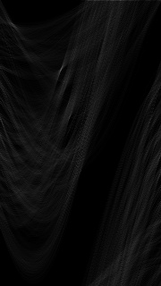  |

答案 >> [answers/answer_44.py](https://github.com/yoyoyo-yo/Gasyori100knock/blob/master/Question_41_50/answers/answer_44.py)

## Q.45. 霍夫变换（Hough Transform）／直线检测——第二步：NMS

我们将在这里进行第2步。

在问题44​获得的表格中，在某个地方附近集中了很多票。这里，执行提取局部最大值的操作。

这一次，提取出投票前十名的位置，并将其表示出来。

NMS 的算法如下：
1. 在该表中，如果遍历到的像素的投票数大于其8近邻的像素值，则它不变。
2. 如果遍历到的像素的投票数小于其8近邻的像素值，则设置为0。

| 输入 (thorino.jpg) | 输出 (answers/answer_45.jpg) |
| :----------------: | :--------------------------: |
|    |  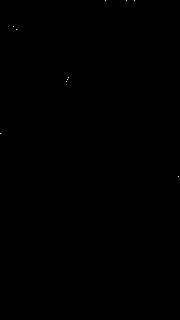  |

答案 >> [answers/answer_45.py](https://github.com/yoyoyo-yo/Gasyori100knock/blob/master/Question_41_50/answers/answer_45.py)

## Q.46. 霍夫变换（Hough Transform）／直线检测——第三步：霍夫逆变换

这里是将问题45中得到的极大值进行霍夫逆变换之后画出得到的直线。在这里，已经通过霍夫变换检测出了直线。

算法如下：
1. 极大值点(r,t)通过下式进行逆变换：

```bash
y = - cos(t) / sin(t) * x + r / sin(t)
x = - sin(t) / cos(t) * y + r / cos(t)
```

2. 对于每个局部最大点，使y = 0-H -1，x = 0-W -1，然后执行1中的逆变换，并在输入图像中绘制检测到的直线。请将线的颜色设置为红色(R,G,B) = (255, 0, 0)。

| 输入 (thorino.jpg) | 输出 (answers/answer_46.jpg) |
| :----------------: | :--------------------------: |
|    |  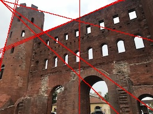  |

答案 >> [answers/answer_46.py](https://github.com/yoyoyo-yo/Gasyori100knock/blob/master/Question_41_50/answers/answer_46.py)

## Q.47. 形态学处理：膨胀（Dilate）

*将`imori.jpg`大津二值化之后，进行两次形态学膨胀处理。

モルフォロジー処理にとは二値化画像の白(255)マス部分を4近傍(上下左右1マス)に膨張、または1マスだけ収縮させる処理をいう。

この膨張と収縮を何度も繰り返すことで1マスだけに存在する白マスを消したり(Q.49. オープニング処理)、本来つながってほしい白マスを結合させたりできる(Q.50. クロージング処理)。

モルフォロジー処理の膨張(Dilation)アルゴリズムは、
注目画素I(x, y)=0で、I(x, y-1), I(x-1, y), I(x+1, y), I(x, y+1)のどれか一つが255なら、I(x, y) = 255 とする。


つまり、上の処理を2回行えば2マス分膨張できることになる。

例えば、[[0,1,0], [1,0,1], [0,1,0]] のフィルタを掛けた和が255を超えれば膨張である、と考える。

| 输入 (imori.jpg) | 大津の二値化(answers/answer_4.jpg) | 输出 (answers/answer_47.jpg) |
| :--------------: | :--------------------------------: | :--------------------------: |
|    |           |  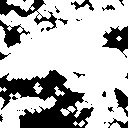  |

答案 >> [answers/answer_47.py](https://github.com/yoyoyo-yo/Gasyori100knock/blob/master/Question_41_50/answers/answer_47.py)

## Q.48. 形态学处理：腐蚀（Erode）

将`imori.jpg`大津二值化之后，进行两次形态学腐蚀处理。

モルフォロジー処理の膨張(Erosion)アルゴリズムは、
注目画素I(x, y)=255で、I(x, y-1), I(x-1, y), I(x+1, y), I(x, y+1)のどれか一つが255なら、I(x, y) = 0 とする。

例えば、[[0,1,0], [1,0,1], [0,1,0]] のフィルタを掛けた和が255*4未満なら収縮である、と考える。

| 输入 (imori.jpg) | 大津の二値化(answers/answer_4.jpg) | 输出 (answers/answer_48.jpg) |
| :--------------: | :--------------------------------: | :--------------------------: |
|    |           |  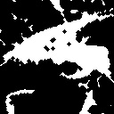  |

答案 >> [answers/answer_48.py](https://github.com/yoyoyo-yo/Gasyori100knock/blob/master/Question_41_50/answers/answer_48.py)

## Q.49. 开运算（Opening Operation）

大津二值化之后，进行开运算（N=1）吧。

开运算，即先进行N次腐蚀再进行N次膨胀。

开运算可以用来去除仅存的小块像素。

| 输入 (imori.jpg) | 大津の二値化(answers/answer_4.jpg) | 输出 (answers/answer_49.jpg) |
| :--------------: | :--------------------------------: | :--------------------------: |
|    |           |  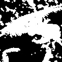  |

答案 >> [answers/answer_49.py](https://github.com/yoyoyo-yo/Gasyori100knock/blob/master/Question_41_50/answers/answer_49.py)

## Q.50. 闭运算（Closing Operation）

Canny 边缘检测之后，进行闭处理吧（N=1）。

闭运算，即先进行N次膨胀再进行N次腐蚀。

闭运算能够将中断的像素连接起来。

| 输入 (imori.jpg) | Canny(answers/answer_43.jpg) | 输出 (answers/answer_50.jpg) |
| :--------------: | :--------------------------: | :--------------------------: |
|    |    |  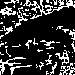  |

答案 >> [answers/answer_50.py](https://github.com/yoyoyo-yo/Gasyori100knock/blob/master/Question_41_50/answers/answer_50.py)
