# Q. 51 - 60

## Q.51. 形态学梯度（Morphology Gradient）

在进行大津二值化之后，计算图像的形态学梯度吧。

形态学梯度为经过膨胀操作（dilate）的图像与经过腐蚀操作（erode）的图像的差，可以用于抽出物体的边缘。

在这里，形态学处理的核`N=1`。

| 输入 (imori.jpg) | 输出(answers/answer_51.jpg) |
| :--------------: | :-------------------------: |
|    | 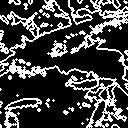  |

答案 >> [answers/answer_51.py](https://github.com/yoyoyo-yo/Gasyori100knock/blob/master/Question_51_60/answers/answer_51.py)

## Q.52. 顶帽（Top Hat）

在进行大津二值化之后，进行顶帽运算吧。

顶帽运算是原图像与开运算的结果图的差。

在这里，我们求大津二值化之后的图像和开处理（`N=3`）之后的图像的差，可以提取出细线状的部分或者噪声。

 样例图片不好突出显示顶帽运算的效果，如果找到了其它适合的图像会在这里作出更正。

| 输入 (imori.jpg) | 大津の二値化(answers/answer_4.jpg) | 输出(answers/answer_52.jpg) |
| :--------------: | :--------------------------------: | :-------------------------: |
|    |           | 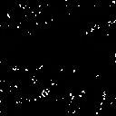  |

答案 >> [answers/answer_52.py](https://github.com/yoyoyo-yo/Gasyori100knock/blob/master/Question_51_60/answers/answer_52.py)

## Q.53. 黑帽（Black Hat）

在进行大津二值化之后，进行黑帽运算吧。

黑帽运算是原图像与闭运算的结果图的差。

在这里，我们求大津二值化之后的图像和闭处理（`N=3`）之后的图像的差，在这里和顶帽运算一样，可以提取出细线状的部分或者噪声。

样例图片不好突出显示黑帽运算的效果，如果找到了其它适合的图像会在这里作出更正。

| 输入 (imori.jpg) | 大津の二値化(answers/answer_4.jpg) | 输出(answers/answer_53.jpg) |
| :--------------: | :--------------------------------: | :-------------------------: |
|    |           | 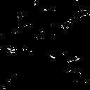  |

答案 >> [answers/answer_53.py](https://github.com/yoyoyo-yo/Gasyori100knock/blob/master/Question_51_60/answers/answer_53.py)

## Q.54. 使用误差平方和算法（Sum of Squared Difference）进行模式匹配（Template Matching）

在这里我们使用误差平方和进行模式匹配。将`imoripart.jpg`在`imori.jpg`中匹配的图像使用红框框出来。

模式匹配，即寻找待匹配图像和全体图像中最相似的部分，用于物体检测任务。现在虽然使用卷积神经网络（`CNN`）来检测物体，但是模式识别仍然是最基本的处理方法。

下面介绍具体算法。原图像记为I（H x W），待匹配图像为T（h x w）：

1. 对于图像I：、for ( j = 0, H-h)  for ( i = 0, W-w)在一次移动1像素的过程中，原图像I的一部分I(i:i+w, j:j+h)与待匹配图像计算相似度S。
2. S最大或最小的地方即为匹配的位置。

S的计算方法主要有 `SSD`、`SAD`（第55题）、`NCC`（第56题）、`ZNCC`（第57题）等。对于不同的方法，我们需要选择出最大值或者最小值。

在这里我们使用误差平方和`SSD`（Sum of Squared Difference）。`SSD`计算像素值的差的平方和，S取误差平方和最小的地方。

```bash
S = Sum_{x=0:w, y=0:h} (I(i+x, j+y) - T(x, y) )^2
```

顺便说一句，像模式匹配这样，从图像的左上角开始往右进行顺序查找的操作一般称作光栅扫描（Raster Scan）或者滑动窗口扫描（原文是`スライディングウィンドウ`，没有找到确定的对应英文，我觉得是 `Sliding Window`）。这样的术语在图像处理邻域经常出现。

可以使用`cv2.rectangle ()`来画矩形。另外，`imoripart.jpg`稍微改变了颜色。

> 这句话我也不知道啥意思，原文是“ちなみに imoripart.jpg は若干色味を変えています。”
>
> ——gzr

| 输入 (imori.jpg) | template图像(imori_part.jpg) | 输出(answers/answer_54.jpg) |
| :--------------: | :--------------------------: | :-------------------------: |
|    |     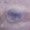      | 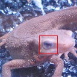  |

答案 >> [answers/answer_54.py](https://github.com/yoyoyo-yo/Gasyori100knock/blob/master/Question_51_60/answers/answer_54.py)

## Q.55. 使用绝对值差和（Sum of Absolute Differences）进行模式匹配

在这里我们使用绝对值差和进行模式匹配。将`imoripart.jpg`在`imori.jpg`中匹配的图像使用红框框出来。

绝对值差和（Sum of Absolute Differences）计算像素值差的绝对值之和，选取S**最小**的位置作为匹配。

```bash
S = Sum_{x=0:w, y=0:h} |I(i+x, j+y) - T(x, y)|
```

| 输入 (imori.jpg) | template图像(imori_part.jpg) | 输出(answers/answer_55.jpg) |
| :--------------: | :--------------------------: | :-------------------------: |
|    |           |   |

答案 >> [answers/answer_55.py](https://github.com/yoyoyo-yo/Gasyori100knock/blob/master/Question_51_60/answers/answer_55.py)

## Q.56. 使用归一化交叉相关（Normalization Cross Correlation）进行模式匹配

在这里我们使用归一化交叉相关进行模式匹配。将`imoripart.jpg`在`imori.jpg`中匹配的图像使用红框框出来。

归一化交叉相关（Normalization Cross Correlation）求出两个图像的相似度，匹配S**最大**处的图像：

```bash
     Sum_{x=0:w, y=0:h} |I(i+x, j+y) T(x, y)|
S = -----------------------------------------------------------------------------
    Sqrt(Sum_{x=0:w, y=0:h} I(i+x, j+y)^2) * Sqrt(Sum_{x=0:w, y=0:h} T(x, y)^2)
```

S最后的范围在-1<=S<=1。`NCC`对变化十分敏感。

> 原文是“`NCC`は証明変化に強いと言われる”，这句话我不知道怎么翻译为好。
>
> ——gzr

| 输入 (imori.jpg) | template图像(imori_part.jpg) | 输出(answers/answer_56.jpg) |
| :--------------: | :--------------------------: | :-------------------------: |
|    |           |   |

答案 >> [answers/answer_56.py](https://github.com/yoyoyo-yo/Gasyori100knock/blob/master/Question_51_60/answers/answer_56.py)

## Q.57. 使用零均值归一化交叉相关（Zero-mean Normalization Cross Correlation）进行模式匹配

在这里我们使用零均值归一化交叉相关进行模式匹配。将`imoripart.jpg`在`imori.jpg`中匹配的图像使用红框框出来。

零均值归一化交叉相关（Zero-mean Normalization Cross Correlation）求出两个图像的相似度，匹配S最大处的图像。

图像I的平均值记为mi，图像T的平均值记为mt。使用下式计算S：

```bash
       Sum_{x=0:w, y=0:h} |(I(i+x, j+y)-mi) (T(x, y)-mt)|
S = --------------------------------------------------------------------------------------
    Sqrt(Sum_{x=0:w, y=0:h} (I(i+x, j+y)-mi)^2) * Sqrt(Sum_{x=0:w, y=0:h} (T(x, y)-mt)^2)
```

S最后的范围在-1<=S<=1。零均值归一化积相关去掉平均值的话就是归一化交叉相关，据说这比归一化交叉相关对变换更加敏感（但是这里匹配失败了）。

| 输入 (imori.jpg) | template图像(imori_part.jpg) | 输出(answers/answer_57.jpg) |
| :--------------: | :--------------------------: | :-------------------------: |
|    |           | 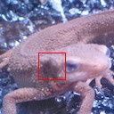  |

答案 >> [answers/answer_57.py](https://github.com/yoyoyo-yo/Gasyori100knock/blob/master/Question_51_60/answers/answer_57.py)

## Q.58. 4邻接连通域标记

将`seg.png`进行4邻接连通域标记吧。

连通域标记（Connected Component Labeling）是将邻接的像素打上相同的标记的作业。

也就是说：

```bash
黒　黒　黒　黒
黒　白　白　黒
黒　白　黒　黒
黒　黒　黒　黒
```

将相邻的白色像素打上相同的标记。 

像这样的像素组成的被标记的块被称为连通区域（Connected Component）。

在这里我们为4​邻域的像素打上标记。另，在这里我们使用一种被称为Lookup Table（这里我没有找到确切的中文翻译，原文是“ルックアップテーブル”，在[这里](http://imagingsolution.blog.fc2.com/blog-entry-193.html)有对Lookup Table更详尽的解释）的东西。

Lookup Table是这样的：

```bash
|   Source   |    Distination   | 
|     1      |         1        |
|     2      |         2        |
|     3      |         1        |
```

一开始被打上1标签的像素（即`Source=1`的像素）最终被分配到的标签为1（`Distination=1`）；一开始被打上3标签的像素（即`Source =3`的像素）最终被分配的的标签也为1（`Distination=1`）。

算法如下：

1. 从左上角开始进行光栅扫描。
2. 如果当前遍历到的像素`i(x,y)`是黑像素的什么也不干。如果是白像素，考察该像素的上方像素`i(x,y-1)`和左边像素`i(x-1,y)`，如果两个的取值都为0，将该像素分配一个新的标签（在这里我们用数字做标签，即1,2,\cdots原文是说“最後に割り当てたラベル + 1 を割り当てる”，直译就是分配给该像素将最后分配的标签加1数值的标签）。
3. 如果两个像素中有一个不为0（也就是说已经分配了标签），将上方和左边的像素分配的标签中数值较小的那一个（0除外）分配给当前遍历到的像素`i(x,y)`。在这里，将上方像素和左边像素的标签写入`Lookup Table`的`Source`，将当前遍历的像素`i(x,y)`分配的标签写入`Distination`。
4. 最后，对照`Lookup Table`，对像素分配的标签由`Source`变为`Distination`。


像这样的话，邻接像素就可以打上同样的标签了。因为这里是做4邻接连通域标记，所以我们只用考察上方像素和左边像素。

| 输入 (seg.png) | 输出(answers/answer_58.png) |
| :------------: | :-------------------------: |
|  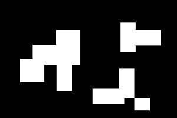  | 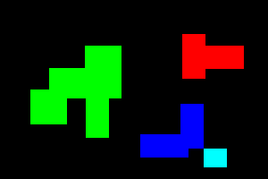  |

答案 >> [answers/answer_58.py](https://github.com/yoyoyo-yo/Gasyori100knock/blob/master/Question_51_60/answers/answer_58.py)

## Q.59. 8邻接连通域标记

在这里我们将问题58变为8邻接连通域标记。

要进行8邻接连通域标记，我们需要考察`i(x-1,y-1)`，`i(x, y-1)`，`i(x+1,y-1)`，`i(x-1,y)`这4个像素。

| 输入 (seg.png) | 输出(answers/answer_59.png) |
| :------------: | :-------------------------: |
|    | 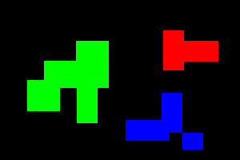  |

答案 >> [answers/answer_59.py](https://github.com/yoyoyo-yo/Gasyori100knock/blob/master/Question_51_60/answers/answer_59.py)

## Q.60. 透明混合（Alpha Blending）

将`imori.jpg`和`thorino.jpg`按照6:4的比例透明混合吧。

透明混合即通过设定透明度（Alpha值）来设定图像透明度的方法。在 OpenCV 中虽然没有透明度这个参数，但在PIL等库中有。在这里我们手动设定透明度。

将两张图片重合的时候，这个方法是有效的。

将`img1`和`img2`按1:1的比例重合的时候，使用下面的式子。通过改变 Alpha 值，你可以更改两张图片重叠的权重。

```bash
alpha = 0.5
out = img1 * alpha + img2 * (1 - alpha)
```

| 输入 (imori.jpg) | 输入2 (thorino.jpg) | 输出(answers/answer_60.jpg) |
| :--------------: | :-----------------: | :-------------------------: |
|    |  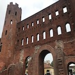   | 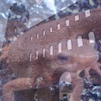  |

答案 >> [answers/answer_60.py](https://github.com/yoyoyo-yo/Gasyori100knock/blob/master/Question_51_60/answers/answer_60.py)
