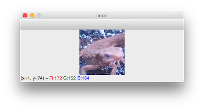
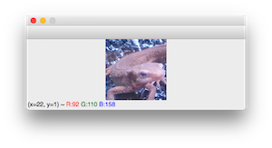
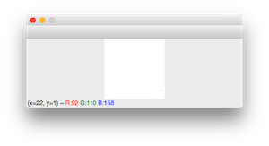
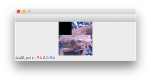
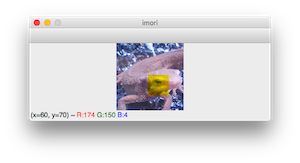

> 下文中的“终端”一词，在`Windows`系统下指`命令提示符`；在类`Unix`系统下指`terminal`。
>
> ——gzr

# Python Tutorial

> 想使用 C++ 的人请点[这里](https://github.com/yoyoyo-yo/Gasyori100knock/blob/master/Tutorial/README_opencv_c_install.md)。

在这里介绍几个在图像处理中会用到的`NumPy`的使用方法。

`NumPy`是`Python`的一个包（`package`）（就像`C`中的库（`library`）一样），擅长进行矩阵运算。

在图像处理领域，有`OpenCV`这样的库，其中的`API`可以进行各种各样的图像处理。现在，我们将要使用`NumPy`来自己实现`OpenCV`中的功能。

由于`Python`中的`OpenCV`基于`NumPy`，所以可以说使用`NumPy`就等于使用`OpenCV`。

下面的例子不运行`.py`文件，而是直接在终端中运行。

## 环境设定

请使用`Python-3.6`环境（答案也是使用`Python-3.6`）。

### 1. 安装 `Miniconda`

在[这里](https://conda.io/miniconda.html)下载安装 `Miniconda`。使用 Windows 或者 MacOS 都可以。如果已经安装 `Miniconda`，打开终端（在 Windows 下是命令提示符，在 MacOS 下是终端），使用以下命令创建 `conda` 虚拟环境：

```bash
$ conda create python=3.6 -n gasyori100
```

激活虚拟环境：

```bash
$ source activate gasyori100
```

如果成功的话，终端会变成这个样子：

```bash
(gasyori100) :~/work_space/Gasyori100knock/ :$ 
```

### 2. 安装模块

使用以下的指令安装模块：

```bash
$ pip install numpy matplotlib opencv-python
```

或者可以用主目录下的 `requirements.txt` 来完成安装：

```bash
$ pip install -r requirements.txt
```

### 3. 图像处理教程

将下面的文件保存为 `sample.py`，测试运行，看能不能运行成功。

```python
import cv2

img = cv2.imread("assets/imori.jpg")
cv2.imshow("imori", img)
cv2.waitKey(0)
cv2.destroyAllWindows()
```

```bash
$ python sample.py
```

如果出现了以下的图像，那么就表示成功啦！按任意的按钮窗口就会消失。



如果你不能成功地安装上面的环境，也可以使用 [Google Colaboratory](https://qiita.com/karaage0703/items/e0b57b63dbebed908b2f) 在浏览器上超便捷地运行 Python！


接下来，我将解释如何使用 `NumPy` 进行图像处理（已经了解的人可以跳过）。

## 运行 `Python`

在终端上打出`python`。如果成功的话，会出现`>>>`这样的提示符。

```bash
(gasyori100) :~/work_space/Gasyori100knock/Tutorial :$ python
Python 3.6.7 |Anaconda, Inc.| (default, Oct 23 2018, 14:01:38) 
[GCC 4.2.1 Compatible Clang 4.0.1 (tags/RELEASE_401/final)] on darwin
Type "help", "copyright", "credits" or "license" for more information.
>>> 
```
## `import`

现在，我们导入包。

我们将`OpenCV`使用`import cv2`导入；`NumPy`使用 `import numpy as np`导入，其中`np`是别名。

```python
>>> import cv2
>>> import numpy as np
```

## 读取及显示图像

读取图像使用`imread()`函数。我们使用以下命令读取`imori.jpg`：

```bash
>>> img = cv2.imread("imori.jpg")
```

在这里我们将图像以`NumPy`的形式保存在变量`img`中。

我们可以使用`img.shape`来获得图像的大小。返回的元组（`touple`）中的三个数依次表示高度、宽度和通道数。例如这个图像高`128px`，宽`128px`，有三个通道（蓝通道、绿通道、红通道）。

```bash
>>> img.shape
(128, 128, 3)
>>>
```

使用`img.dtype`来获得图片的类型。`uint8`是一个 8 位无符号整数。图像的`RGB`分量通常用 0 到 255 的 256 个灰度表示。例如，红色像素为 (R,G,B)=(255,0,0) ，白色是 (R,G,B)=(255,255,255) 。如果图像不以这个类型保存的话，图像会变得很奇怪（后面说明）。

```bash
>>> img.dtype
dtype('uint8')
>>>
```

使用`cv2.imshow()`来显示图像。`cv2.imshow()`的第一个参数是窗口的名字（不写也没有关系），第二个参数是要显示的图像的名称，一定要写。

`cv2.waitKey(0)`可以让窗口一直显示图像直到按下任意按键（如果你希望了解更多关于这个函数的信息，请自己查找资料）。

```bash
>>> cv2.imshow('', img); cv2.waitKey(0)
102
>>> 
```




例如，让`img`的类型变更为`float32`的话，可以使用`astype()`：

```bash
>>> _img = img.astype(np.float32)
```

如果用这种类型显示图片，就会变成这样。也就是说，用不恰当的类型显示图片的话图片就会变得奇怪（但是你可以用这种类型保存图片）。所以当你想要操作图像时：
1. 使用`cv2.imread`读取图像；
2. 将图像的类型变为浮点型`np.float32`；
3. 操作图像；
4. 像素值不满 0 的将值设置为 0 ，像素值超过 255 的将值设置为 255 （超重要）；
5. 将图像类型变更为`np.uint8`并保存；

以上是推荐的操作顺序。第 4 步将在下面的部分“操作像素”介绍。

```bash
>>> cv2.imshow('', _img); cv2.waitKey(0)
102
>>>
```



## 操作像素

操作图像的方法和`NumPy`几乎是一样的。

例如，操作 x=30,y=20 的像素值时，进行以下的操作。像素值是按 BGR 的顺序排列的。`array()` 表示这个图像是 `NumPy` 格式。也就是说，`OpenCV` 是 `NumPy` 的高层封装。

```bash
>>> img[20, 30]
array([232, 178, 171], dtype=uint8)
>>> 
```

更进一步，要得到 x=30,y=20 处的 G 分量，可以使用以下代码：

```bash
>>> img[20, 30, 1]
178
>>> 
```

下面开始进入`NumPy`的中心话题。

`NumPy`有一个称为**切片（Slice）**的功能，可以让我们访问从特定的值`v1`到特定的值`v2`之间的所有元素。

例如要查看 y=20, x=[30, 32] 这个范围之内（的像素）时，如果设置为`30:33`可以得到一个矩阵。如果设置`a:b`，可以获得在 a\leq  v < b 范围内的值。顺便说一下，如果设置为`:30`可以获得 [0, 30] 范围内的像素；如果设置为`30:`的话，可以获得 [30,最后] 像素的值。

```bash
>>> img[20, 30:33]
array([[232, 178, 171],
[209, 156, 153],
[134,  85,  77]], dtype=uint8)
>>> 
```

例如将图片左上角（ x=[0, 50], y = [0, 50] ）设置为黑色，是照下面这样做。`copy()`这个函数在后面介绍。

```bash
>>> img2 = img.copy()
>>> img2[:50, :50] = 0
>>> cv2.imshow("", img2); cv2.waitKey(0)
0
>>>
```



在之前的教程中我们提到：

> 像素的值小于 0​ 的时候设置为​ 0​，超过​ 255​ 的时候修改为​ 255​。

现在我对此作出说明。

例如，图像的类型为`float32`，将一部分的`B`分量改为 260​。`uint8`类型的整数范围只能取​ [0,255] ，如果变成`uint8`型的话蝾螈的颜色一部分就会变成黄色的。

**这是因为，如果将 260​ 变为`uint8`型的话，因为 260-256，所以会让`B`的值为 4。**经常会由于这个原因让像素的值变得不正确。所以上面的第四步的操作（限定值的范围在$[0,255]$之间）是必要的。

```bash
>>> img2 = img.copy().astype(np.float32)
>>> img2[60:100, 60:100, 0] = 260
>>> cv2.imshow("imori", img2.astype(np.uint8)); cv2.waitKey(0)
```



## 拷贝图像

想要将图像拷贝到别的变量的时候使用`copy()`。

```bash
>>> img2 = img.copy()
```

如果单纯地让`img2 = img`，因为仅仅是保存图片的地址，对`img2`进行的操作也会反映到`img`上。

如果没有特殊用途，**请使用`copy()`拷贝图像**。

## 保存图像

使用`cv2.imwrite()`来保存图像。

例如之前的被保存为名称为`sample.jpg`的图像`img2`，如果返回值为`True`的话，这就说明该图像被保存在同一个文件夹中，文件名为`sample.jpg`。

```bash
>>> cv2.imwrite("sample.jpg", img2)
True
>>>
```

## 练习问题

将图像的左半部分的红通道和蓝通道交换。


回答例

```bash
>>> import cv2
>>> img = cv2.imread("imori.jpg")
>>> img3 = img.copy()
>>> H, W, C = img3.shape
>>> img3[:H//2, :W//2] = img3[:H//2, :W//2, (2, 1, 0)]
>>> cv2.imshow('', img3); cv2.waitKey(0)
102
>>> 
```

上面就是所有的 Tutorial 了。之后请一个一个地解决问题吧！
