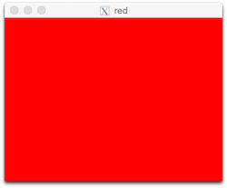
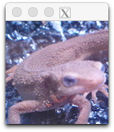
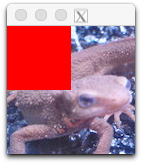
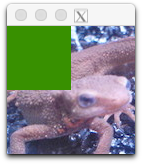
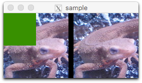

# C++ Tutorial

## C++ 上`OpenCV的安装

> 想使用 Python 的人请点[这里](https://github.com/yoyoyo-yo/Gasyori100knock/blob/master/Tutorial/README.md)。

假定使用 Ubuntu-16.04（18.04 也可以）。我认为使用 Docker 很方便。

### 安装 Package

```bash
$ apt install build-essential cmake checkinstall libgtk-3-dev libjpeg-dev libpng++-dev wget emacs vim sudo
```
### 下载 `OpenCV`

```bash
$ mkdir opencv
$ cd oepncv
$ wget https://github.com/opencv/opencv/archive/3.4.0.tar.gz
$ tar zxvf 3.4.0.tar.gz
$ cd opencv-3.4.0
$ mkdir build
$ cd build
$ cmake ..
$ make -j4
$ make install
```
### 示例程序

将下面的代码保存为 `sample.cpp`：

```cpp
#include <opencv2/core.hpp>
#include <opencv2/highgui.hpp>
#include <iostream>

int main(int argc, const char* argv[]){
  cv::Mat redImg(cv::Size(320, 240), CV_8UC3, cv::Scalar(0, 0, 255));
  cv::namedWindow("red", cv::WINDOW_AUTOSIZE);
  
  cv::imshow("red", redImg);
  cv::waitKey(0);

  cv::destroyAllWindows();

  return 0;
}
```

执行下面的命令：

```bash
$ g++ sample.cpp -o sample -lopencv_core -lopencv_imgcodecs -lopencv_highgui
```

如果通过编译的话，文件夹内会出现名为 `sample` 的文件。然后输入以下指令执行：

```bash
$ ./sample
```

出现下面的窗口就表示成功了！！



下面讲解图像处理的基本操作（已经了解的人请跳过，直接看问题）。

## 读取图像

在 C++ 上使用 `OpenCV`时，一定要 `include`下面的东西：

```cpp
#include <opencv2/core.hpp>
#include <opencv2/highgui.hpp>
```

读取图像时请将图像存入 `Mat` 类型的变量中。`OpenCV` 的变量全部在`cv` 命名空间（namespace）中。

```cpp
cv::Mat img = cv::imread("imori.jpg", cv::IMREAD_COLOR);
```

读取图像的长宽：

```cpp
int width = img.rows;
int height = img.cols;
```

## 显示图像

显示图像时请使用 `imshow` 和 `waitKey()`。`imshow`的第一个参数表示窗口的名称，现在不用管它。第二个参数是想显示的图像变量。按任意键窗口消失。

```cpp
cv::imshow("sample", img);
cv::waitKey(0);
cv::destroyAllWindows();
```



## 操作像素

使用 `at` 方法来操作像素。下面可以读取 x=30, y=20 位置处的像素。

```cpp
std::cout << img.at<cv::Vec3b>(30,20) << std::endl;
```

比如说将图像左上半部分变成红色：

```cpp
int i = 0, j = 0;
for (i = 0; i < width / 2; i++){
  for (j = 0; j < height / 2; j++){
    img.at<cv::Vec3b>(y,x)[0] = 0;
    img.at<cv::Vec3b>(y,x)[1] = 0;
    img.at<cv::Vec3b>(y,x)[2] = 255;
  }
}
```



顺便说一句，使用 C++ 时如果输入超过 [0, 255] 范围的值的话，编译时会有溢出（overflow）警告。例如：

```cpp
for(i=0; i<width/2; i++){
  for(j=0; j<height/2; j++){
    img.at<cv::Vec3b>(j, i)[0] = 0;
    img.at<cv::Vec3b>(j, i)[1] = 400;
    img.at<cv::Vec3b>(j, i)[2] = -200;
  }
}
```
x=30, y=20 处的值会变成下面的样子：

```bash
[0, 144, 56]
```
因为144 = 400 - 256, 56 = 256 - 200，图像会变成绿色的。



由于 `img.at<cv::Vec3b>(j, i)` 处是`unsigned char`类型的值的话，所以如果你想读取 RGB 的值的话，必须像下面这样做：

```cpp
unsigned char tmp = img.at<cv::Vec3b>(j,i);
```

## 拷贝图像

如果想把图像保存到不同的变量中，请使用 `clone` 方法：

```cpp
cv::Mat img2 = img.clone();
```

## 显示多张图像

在 OpenCV 中想并排显示两张图像的话请像下面这样做：

```cpp
cv::Mat disp;
cv::Mat tmp[3];
tmp[0] = img;
tmp[1] = cv::Mat (cv::Size(10, height), CV_8UC3, cv::Scalar(0,0,0));
tmp[2] = img2;
cv::hconcat(tmp, 3, disp);

cv::imshow("sample", disp);
cv::waitKey(0);
```

显示效果如下：



## 保存图像

保存时，使用`cv::imwrite()`方法：

```cpp
cv::imshow("out.jpg", disp);
```

## 练习问题

将图像的左半部分的红通道和蓝通道交换。


回答例

```cpp
#include <opencv2/core.hpp>
#include <opencv2/highgui.hpp>
#include <iostream>

int main(int argc, const char* argv[]){
  cv::Mat img = cv::imread("imori.jpg", cv::IMREAD_COLOR);

  int width = img.rows;
  int height = img.cols;

  cv::Mat out = img.clone();

  for(int i=0; i<width/2; i++){
    for(int j=0; j<height/2; j++){
      unsigned char tmp = out.at<cv::Vec3b>(j, i)[0];
      out.at<cv::Vec3b>(j, i)[0] = out.at<cv::Vec3b>(j, i)[2];
      out.at<cv::Vec3b>(j, i)[2] = tmp;
    }
  }

  cv::imwrite("out.jpg", out);
  cv::imshow("sample", out);
  cv::waitKey(0);
  cv::destroyAllWindows();

  return 0;
}
```

答案 >> https://github.com/yoyoyo-yo/Gasyori100knock/blob/master/Tutorial/answer.cpp

上面就是所有的 Tutorial 了。之后请一个一个地解决问题吧！
